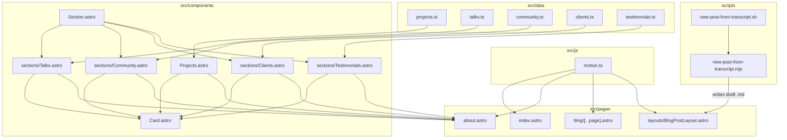

# Portfolio Roadmap

A phased, implementation-ready plan for evolving `sergioestrella.com` along four axes: **UX**, **UI**, **new sections**, and **content workflow**. The roadmap is intentionally additive: it preserves the current Astro static-site architecture, the existing routes, and the file-based blog so that nothing breaks unless a content-model change is explicitly approved.

---

## 1. Vision and Design Direction

The site today is a small, Spanish-first personal blog with a thin landing page and a richer "About" page. The target evolution is a more **editorial, credibility-focused personal portfolio** that:

- Tells a stronger story around work, talks, community, and clients.
- Uses subtle, intentional motion (GSAP) to add personality without hurting readability or accessibility.
- Keeps the current writing-first feel of the blog, with cleaner, single-column reading.
- Provides an internal authoring tool to turn raw transcripts into ready-to-edit blog posts.

Non-goals (for this roadmap):

- Full visual rewrite of `global.css`.
- Migration to Astro Content Collections (could be a later, separate initiative).
- Changing the deployment/hosting model.

---

## 2. Current Architecture (Source of Truth)

These are the exact files and patterns the roadmap builds on. Each phase below cites them.

### Pages and layouts

- [`src/pages/index.astro`](../src/pages/index.astro) — landing page: about hero + last 3 posts via `formatBlogPosts`.
- [`src/pages/about.astro`](../src/pages/about.astro) — bio, work experience list, projects (via `Projects.astro`).
- [`src/pages/blog/[...page].astro`](../src/pages/blog/[...page].astro) — paginated blog index (`pageSize: 6`).
- [`src/pages/category/[category].astro`](../src/pages/category/[category].astro) — category archive built from `frontmatter.category`.
- [`src/pages/rss.xml.js`](../src/pages/rss.xml.js) — RSS feed (uses `./blog/**/*.md`).
- [`src/layouts/MainLayout.astro`](../src/layouts/MainLayout.astro) — global shell, fonts, head, nav, footer.
- [`src/layouts/MainHead.astro`](../src/layouts/MainHead.astro) — SEO + Partytown/Google Analytics + Lite YouTube helper.
- [`src/layouts/BlogPostLayout.astro`](../src/layouts/BlogPostLayout.astro) — post shell: header + content + sidebars (categories + related).

### Components

- [`src/components/Nav.astro`](../src/components/Nav.astro), [`src/components/Footer.astro`](../src/components/Footer.astro)
- [`src/components/PostCard.astro`](../src/components/PostCard.astro), [`src/components/PostHeader.astro`](../src/components/PostHeader.astro)
- [`src/components/CategoryCloud.astro`](../src/components/CategoryCloud.astro), [`src/components/RelatedPosts.astro`](../src/components/RelatedPosts.astro)
- [`src/components/Pagination.astro`](../src/components/Pagination.astro)
- [`src/components/Projects.astro`](../src/components/Projects.astro) — keeps a hardcoded `PROJECTS` array inline.
- [`src/components/ExperienceItem.astro`](../src/components/ExperienceItem.astro)
- [`src/components/Link.astro`](../src/components/Link.astro), [`src/components/LiteYoutube.astro`](../src/components/LiteYoutube.astro), [`src/components/Seo.astro`](../src/components/Seo.astro)

### Data, utils, types

- [`src/data/navData.js`](../src/data/navData.js) — only `Acerca` and `Blog` today.
- [`src/data/siteData.json`](../src/data/siteData.json) — SEO defaults.
- [`src/js/utils.js`](../src/js/utils.js) — `formatBlogPosts`, `slugify`, `formatDate`; filters `draft` and future posts.
- [`src/js/jsonLD.js`](../src/js/jsonLD.js) — JSON-LD generation tied to frontmatter shape.
- [`src/types/posts.ts`](../src/types/posts.ts) — minimal `Post` interface (currently misses `author`, `robots`, and the `image` object shape).

### Styling

- [`src/styles/global.css`](../src/styles/global.css) — single, dense stylesheet with CSS variables and per-section rules. Notable for posts: the post layout becomes two columns at the `--md` breakpoint and wider at `--lg`.

```648:656:src/styles/global.css
  @media (--md) {
    grid-template-columns: 1fr minmax(auto, 220px);
    gap: var(--space-lg);
    align-items: start;
  }

  @media (--lg) {
    grid-template-columns: 1fr minmax(auto, 300px);
  }
```

### Tooling

- [`package.json`](../package.json) — only `dev`, `build`, `preview`, `astro`. **No** `lint`, `test`, or `typecheck` scripts. `pnpm run build` is the de facto verification gate (per `AGENTS.md`).
- [`astro.config.mjs`](../astro.config.mjs) — MDX, sitemap, Partytown, `astro-icon`.
- Content is **not** in a content collection; everything goes through `import.meta.glob("...blog/*.md")` + `formatBlogPosts()`. Any change to discovery or path shape must be applied to **all** consumers (homepage, blog index, category, related, RSS).

---

## 3. Phase 0 — Decisions Before Implementation

These should be answered before opening implementation PRs. None require code changes.

### Content prerequisites

- **Talks**: list of delivered talks with title, event, date, location/online, slides URL, recording URL, language, optional thumbnail.
- **Community**: organizations where Sergio is an organizer (Backbone UTP, GDG, etc.) with role, period, links, logo.
- **Clients showcase**: split into **employee work** (Globant, Selaski, Curoo, etc.) and **freelance/independent**. For each: client name, scope, role, period, logo, link, and a short outcome line. Be careful with wording to avoid implying ownership of employer projects.
- **Testimonials**: name, role, company, photo (optional), quote, source link or proof. Decide which can be published with names/photos.

### Product/technical decisions

- **Tags vs. categories**: today only `frontmatter.category` exists. Decide whether the "tags below the article" requirement means:
  - (a) **Visual chips** built from `category` only (no content-model change), or
  - (b) **Multi-tag frontmatter** (`tags: ["a", "b"]`) — requires changes in posts, types, related-posts logic, and possibly new tag routes.
  - Default recommendation: start with (a) and migrate to (b) only if real value emerges.
- **Transcript-to-post tool**: choose between
  - (a) **Template-only**: a deterministic shell/Node script that scaffolds a Markdown file with frontmatter, headings, and image/video placeholders from a `.txt` transcript.
  - (b) **AI-assisted**: same scaffold, but body is generated by an external LLM (OpenAI/Anthropic/etc.).
  - Default recommendation: ship (a) first; layer (b) behind an opt-in flag.
- **GSAP scope**: confirm motion is acceptable on landing/about/blog index, and that **post pages stay calm** (only header/meta micro-interactions).
- **Accessibility floor**: respect `prefers-reduced-motion`, keep keyboard focus, do not animate text content during reading.
- **i18n**: site stays Spanish-only; new copy must match.

---

## 4. Phase 1 — Architecture Cleanup (No Visual Changes)

Goal: make later phases trivial and additive. No user-visible change.

### Changes

- Create a `src/data/` data layer:
  - `src/data/projects.ts` — move the inline `PROJECTS` array from [`src/components/Projects.astro`](../src/components/Projects.astro) here, typed.
  - `src/data/talks.ts`, `src/data/community.ts`, `src/data/clients.ts`, `src/data/testimonials.ts` — empty arrays + types, ready for content.
- Expand [`src/types/posts.ts`](../src/types/posts.ts) to reflect the real frontmatter (`author`, `robots`, `image: { src, alt }`, optional `tags`, optional `draft`).
- Add `src/types/sections.ts` with shared types: `Talk`, `CommunityRole`, `Client`, `Testimonial`, `Project`.
- Introduce a small reusable `Section.astro` (title + icon + intro slot + content slot) to avoid copy-pasting the `<span class="title">…</span>` pattern from `about.astro`.
- Refactor [`src/components/Projects.astro`](../src/components/Projects.astro) to consume `src/data/projects.ts` (no markup change).

### Risks / guardrails

- Do not change the public API of `Projects.astro` — `about.astro` keeps importing it the same way.
- Keep the `Post` interface backward-compatible (all new fields optional).

---

## 5. Phase 2 — Blog Readability (Single Column + Tags Below)

Goal: keep the article in one column at all breakpoints; move category and related posts beneath the article.

### Changes

- In [`src/styles/global.css`](../src/styles/global.css), **remove or override** the two-column rules on `.post-content` (lines 648–656 above) so the article stays single-column. Tighten `.content` typography:
  - Cap measure with `max-width: var(--content-lg)` (already 65ch) on the article, not on every `<p>`.
  - Increase vertical rhythm (`margin-block` on headings/lists) and inter-paragraph spacing.
  - Style code blocks (currently no rules) with `hsl(var(--muted))` background and `--radius-md`.
- In [`src/layouts/BlogPostLayout.astro`](../src/layouts/BlogPostLayout.astro):
  - Keep the DOM order (article → sidebar) — the sidebar will naturally stack below.
  - Rework `.sidebar` to render as a **horizontal "post footer"** with two blocks: **Tags/Category chips** and **Artículos relacionados**.
  - Add a small "share" row (copy link, X/LinkedIn) below the footer, optional.
- In [`src/components/PostHeader.astro`](../src/components/PostHeader.astro), keep the category badge but move the tag/category cloud out of the post and only into the blog index page if desired.
- If decision (b) on tags is taken later: extend `formatBlogPosts` consumers and `relatedPosts` logic in [`src/layouts/BlogPostLayout.astro`](../src/layouts/BlogPostLayout.astro) to match by `tags` overlap as a fallback to category.

### Risks / guardrails

- `.post-content` styles also affect `blockquote`, `strong`, `em`. Verify all 9 existing posts visually after the change.
- Do not move `CategoryCloud` to a place that requires a new glob; it already shares the same discovery path.

---

## 6. Phase 3 — UX Motion with GSAP

Goal: add subtle but distinctive motion that respects accessibility and performance.

### Setup

- Add `gsap` as a runtime dependency: `pnpm add gsap`.
- Create `src/js/motion.ts` with:
  - A single `gsap.matchMedia()` instance per page, with conditions `isDesktop`, `isMobile`, and `reduceMotion`.
  - A small `revealOnScroll(selector, opts)` helper using `ScrollTrigger.batch()` for staggered entrances.
  - A `heroIntro()` helper for the landing page.
- Register `ScrollTrigger` once: `gsap.registerPlugin(ScrollTrigger)`.
- Use Astro's `<script>` (default = type="module", deferred, bundled) inside the components that need motion. Do **not** route GSAP through Partytown.

### Where to apply motion

- **Landing hero** ([`src/pages/index.astro`](../src/pages/index.astro)): staggered reveal of avatar, headline, subline, and CTA on first paint.
- **Section reveals**: fade/translate-up on every `<section class="container">` as it enters the viewport (use `autoAlpha` + `y: 20`).
- **Project / client / talk cards**: batch reveal with stagger; subtle hover lift via CSS (transform + shadow), not JS.
- **Blog index**: staggered card entrance only.
- **Post page**: keep calm — only animate `PostHeader` meta (title fade-in + small underline grow). No body animation.
- **Reduced motion**: in `matchMedia`, set `duration: 0` or skip animations when `reduceMotion` is true.

### Guardrails

- Always use transform aliases (`x`, `y`, `scale`, `autoAlpha`) — not `width`/`top`/`opacity`.
- Kill ScrollTriggers on view-transitions (if added later) by relying on the `useGSAP`-equivalent pattern: keep all triggers within `matchMedia` so they auto-revert.
- Do not animate elements that contain headings being read aloud by screen readers.

---

## 7. Phase 4 — UI Refresh (Landing, About, Icons, Color)

Goal: lift the landing and about pages from "simple" to "intentional", reusing existing tokens.

### Changes

- **Landing** ([`src/pages/index.astro`](../src/pages/index.astro)):
  - Replace the single avatar + paragraph with a richer hero: name + role + 1-line value prop + CTA cluster (Conoceme más, Contáctame, GitHub).
  - Add a "Ahora" / "Now" strip (1–2 lines about current focus, e.g., Curoo + Backbone).
  - Add a "Métricas" mini-strip: years of experience, talks delivered, communities, posts (computed from data).
  - Keep "Últimos posts" but reduce to 3 with consistent card height.
- **About** ([`src/pages/about.astro`](../src/pages/about.astro)):
  - Promote `getExperienceInYears()` into a reusable helper in `src/js/utils.js`.
  - Replace bare social icon row with a labeled "Encuéntrame" block (icon + handle text).
  - Add a "Stack actual" chip group (typed in `src/data/`).
- **Icons & color**:
  - Audit `astro-icon` usages; introduce a small set of semantic icons per section (briefcase, mic, users, code-tags, message-quote, presentation).
  - In [`src/styles/global.css`](../src/styles/global.css), define accent variants per section (e.g., `--accent-talks`, `--accent-community`) all derived from `--_hue` so both light/dark stay coherent.
- **Cards**:
  - Unify project/talk/client/testimonial cards under a single `Card.astro` primitive (image + tag + title + description + CTAs).

### Guardrails

- Do not change the public structure of `MainLayout` props.
- Keep all changes inside existing breakpoints (`--sm`, `--md`, `--lg`, `--xl`).

---

## 8. Phase 5 — New Sections (Talks, Community, Clients, Testimonials)

Goal: add the four sections, reusing the data layer and `Card.astro` from earlier phases.

### Components and data

- `src/components/sections/Talks.astro` — consumes `src/data/talks.ts`, renders cards (title, event, date, slides, recording link, language).
- `src/components/sections/Community.astro` — consumes `src/data/community.ts`, renders organizer roles with logo, role, period, link.
- `src/components/sections/Clients.astro` — consumes `src/data/clients.ts`, split into two subgroups: **Empresa** and **Freelance**. Each card lists role + outcome.
- `src/components/sections/Testimonials.astro` — consumes `src/data/testimonials.ts`, renders quote cards with attribution.

### Placement

- Default placement: extend [`src/pages/about.astro`](../src/pages/about.astro) with the four new sections, in this order: Experiencia → Talks → Community → Clients → Testimonials → Mis proyectos.
- Optional later: promote each to its own page (e.g., `/talks`, `/community`) and add to [`src/data/navData.js`](../src/data/navData.js). Defer until each section has enough content to justify a page.

### Guardrails

- Empty data arrays must render gracefully (section hidden, not empty).
- Logos/photos go under `public/images/` to keep the asset story consistent with current posts.
- Testimonials require explicit consent from the person quoted before publishing.

---

## 9. Phase 6 — Internal Tool: Transcript → Blog Post

Goal: a repeatable command that turns a `.txt` transcript into a draft `src/pages/blog/<slug>.md` ready to edit, with image/video placeholders.

### Shape

- **Entry point**: a shell wrapper at `scripts/new-post-from-transcript.sh` accepting one positional arg (transcript path):

  ```bash
  scripts/new-post-from-transcript.sh ./transcripts/charla-gdg.txt
  ```

- The shell script delegates to a Node script (`scripts/new-post-from-transcript.mjs`) that does the real work. Reasons: cross-platform, easier file I/O, can grow into AI mode later. The shell wrapper keeps the user-facing command exactly as requested.

### Behavior

1. Validate the input (`.txt`, exists, non-empty).
2. Derive a `slug` from the file name (`slugify`-compatible) and a default `title` from the first non-empty line.
3. Detect simple structure in the transcript (blank-line paragraphs, "?" → questions) and emit Markdown headings every N paragraphs as `## Sección`.
4. Insert clearly-marked placeholders that are easy to find and replace:

   ```markdown
   <!-- IMAGE: replace with /images/<slug>-1.webp, alt text required -->
   <!-- VIDEO: replace with <LiteYoutube id="..." /> -->
   ```

5. Write the output to `src/pages/blog/<slug>.md` with frontmatter that matches existing posts:

   ```yaml
   ---
   layout: "../../layouts/BlogPostLayout.astro"
   title: "<Derived title>"
   date: <today, ISO>
   author: Sergio Estrella
   image: { src: "/images/<slug>.webp", alt: "TODO: alt" }
   description: "TODO: meta description (≤160 chars)"
   category: "TODO"
   draft: true
   ---
   ```

6. Print next steps to stdout: replace placeholders, add real `image`/`description`/`category`, set `draft: false`, run `pnpm run build`.

### Add a script entry

- Optional pnpm alias in [`package.json`](../package.json):

  ```json
  {
    "scripts": {
      "new:post": "node scripts/new-post-from-transcript.mjs"
    }
  }
  ```

### Guardrails

- Output **must** be flat under `src/pages/blog/*.md`. Nested paths would mismatch the globs in [`src/pages/index.astro`](../src/pages/index.astro), [`src/pages/blog/[...page].astro`](../src/pages/blog/[...page].astro), [`src/pages/category/[category].astro`](../src/pages/category/[category].astro), and [`src/layouts/BlogPostLayout.astro`](../src/layouts/BlogPostLayout.astro), even though `rss.xml.js` would still pick them up.
- Default `draft: true` so a half-finished post never reaches the index/RSS (because `formatBlogPosts` filters drafts, and `rss.xml.js` is expected to filter the same way; verify before relying on it).
- Refuse to overwrite an existing slug; require `--force`.
- No network calls in the default mode. AI-assisted mode (later) goes behind a `--ai` flag and an env var.

---

## 10. Suggested Architecture (Visual)



---

## 11. Validation Plan

For every phase:

- Run `pnpm run build` (the documented verification step) and confirm `dist/` is generated without errors.
- Run `pnpm run dev` and visit at minimum:
  - `/` (landing)
  - `/about`
  - `/blog/`
  - `/blog/<one existing slug>` (single post)
  - `/category/<one existing slug>`
  - `/rss.xml`
- Verify content discovery still works: every existing post appears in the index, the right category, the right related list, and RSS.
- Lighthouse pass on `/` and a post page; no regression vs baseline on Performance, Accessibility, Best Practices, SEO.
- Manual a11y checks:
  - Tab order intact through new sections.
  - All images have `alt`.
  - Reduced-motion: with the OS setting on, no entrance/scroll animations should run (or they should run with `duration: 0`).
- Transcript tool:
  - Run on a sample `.txt`, confirm a draft `.md` is created with valid frontmatter.
  - Run `pnpm run build`; the draft should **not** appear in `/blog/` or RSS while `draft: true`.
  - Flip `draft: false`, rebuild, and confirm it appears everywhere it should.

---

## 12. Sequencing Summary

| Phase | Scope | Breaking? | Depends on |
|-------|-------|-----------|------------|
| 0 | Decisions + content gathering | No | — |
| 1 | Data layer + types + `Section.astro` | No | 0 |
| 2 | One-column post + tags below | No (visual) | 1 |
| 3 | GSAP motion + reduced-motion | No | 1 |
| 4 | Landing/About refresh + `Card.astro` | No | 1, 3 |
| 5 | Talks/Community/Clients/Testimonials | No | 1, 4 |
| 6 | Transcript → post tool | No | 0 |

The only optional **breaking-ish** change is moving from `category` to multi-`tags` (Phase 2 option b). It is deferred until clearly justified.
